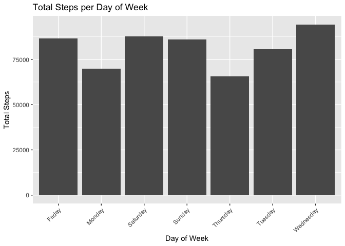
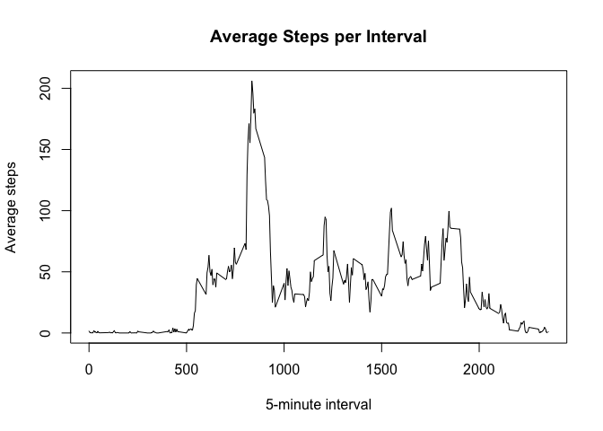
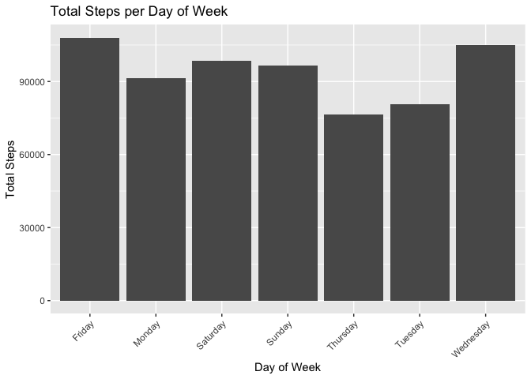
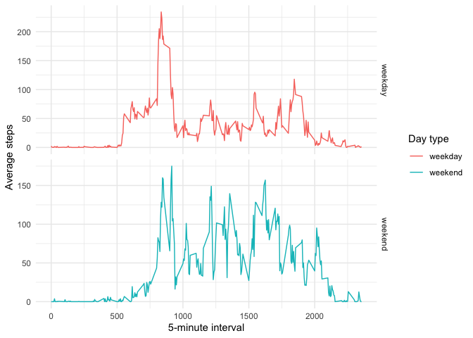

## Loading and preprocessing the data
Loading the data


```r
setwd("~/Documents/Coding/R/R Coursera/M5W2")
data <- read.csv("activity.csv")
data$date <- as.Date(data$date)
```


## What is mean total number of steps taken per day?
Calculate the total number of steps taken per day

```r
total_steps_per_day <- aggregate(steps ~ date, data, sum, na.rm = TRUE)
head(total_steps_per_day)
```

```
##         date steps
## 1 2012-10-02   126
## 2 2012-10-03 11352
## 3 2012-10-04 12116
## 4 2012-10-05 13294
## 5 2012-10-06 15420
## 6 2012-10-07 11015
```


Make a histogram of the total number of steps taken each day

```r
total_steps_per_day$day_of_week <- weekdays(total_steps_per_day$date)
library(ggplot2)
ggplot(total_steps_per_day, aes(x = day_of_week, y = steps)) +
  geom_col() +
  labs(x = "Day of Week", y = "Total Steps", title = "Total Steps per Day of Week") +
  theme(axis.text.x = element_text(angle = 45, hjust = 1))
```

<!-- -->


Calculate and report the mean and median of the total number of steps taken per day


```r
mean_steps <- mean(total_steps_per_day$steps)
median_steps <- median(total_steps_per_day$steps)

print(paste("Mean Steps per Day: ", mean_steps))
```

```
## [1] "Mean Steps per Day:  10766.1886792453"
```

```r
print(paste("Median Steps per Day: ", median_steps))
```

```
## [1] "Median Steps per Day:  10765"
```


## What is the average daily activity pattern?
Make a time series plot


```r
average_steps_per_interval <- aggregate(steps ~ interval, data, mean, na.rm = TRUE)
plot(average_steps_per_interval$interval, average_steps_per_interval$steps, type = "l", xlab = "5-minute interval", ylab = "Average steps", main = "Average Steps per Interval")
```

<!-- -->

Which 5-minute interval, on average across all the days in the dataset, contains the maximum number of steps


```r
max_interval <- average_steps_per_interval$interval[which.max(average_steps_per_interval$steps)]
print(max_interval)
```

```
## [1] 835
```

## Imputing missing values
Calculate and report the total number of missing values in the dataset (i.e. the total number of rows with NAs)


```r
na <- sum(is.na(data))
print(na)
```

```
## [1] 2304
```

Imputing NAs using the mean of the 5 minute interval across all days + creating the new dataset


```r
data_imputed <- data
# For each row in the dataset
for (i in 1:nrow(data_imputed)) {
  # If the 'steps' value is missing
  if (is.na(data_imputed$steps[i])) {
    # Find the mean steps for the interval of the missing value
    mean_steps <- average_steps_per_interval$steps[average_steps_per_interval$interval == data_imputed$interval[i]]
    
    # Replace the missing value with the mean steps
    data_imputed$steps[i] <- mean_steps
  }
}
```

Histogram and central tendencies of new dataset


```r
imp_total_steps_per_day <- aggregate(steps ~ date, data_imputed, sum)
imp_total_steps_per_day$day_of_week <- weekdays(imp_total_steps_per_day$date)
ggplot(imp_total_steps_per_day, aes(x = day_of_week, y = steps)) +
  geom_col() +
  labs(x = "Day of Week", y = "Total Steps", title = "Total Steps per Day of Week") +
  theme(axis.text.x = element_text(angle = 45, hjust = 1))
```

<!-- -->

```r
imp_mean_steps <- mean(imp_total_steps_per_day$steps)
imp_median_steps <- median(imp_total_steps_per_day$steps)

print(paste("Mean Steps per Day: ", imp_mean_steps))
```

```
## [1] "Mean Steps per Day:  10766.1886792453"
```

```r
print(paste("Median Steps per Day: ", imp_median_steps))
```

```
## [1] "Median Steps per Day:  10766.1886792453"
```

### Questions
- Do these values differ from the estimates from the first part of the assignment?
The total steps per day of the week have increased but the central tendencies have not changed much.
- What is the impact of imputing missing data on the estimates of the total daily number of steps?
It has increased the total steps by a few thousand.

## Are there differences in activity patterns between weekdays and weekends?
Create a new factor variable


```r
# Create a new factor variable for whether a given date is a weekday or a weekend day
data$day_type <- ifelse(weekdays(data$date) %in% c("Saturday", "Sunday"), "weekend", "weekday")

# Calculate the average number of steps for each interval separately for weekdays and weekends
average_steps_per_interval_day_type <- aggregate(steps ~ interval + day_type, data, mean)

# Create a panel plot
ggplot(average_steps_per_interval_day_type, aes(x = interval, y = steps, color = day_type)) +
  geom_line() +
  labs(x = "5-minute interval", y = "Average steps", color = "Day type") +
  facet_grid(day_type ~ ., scales = "free_y") +
  theme_minimal()
```

<!-- -->

